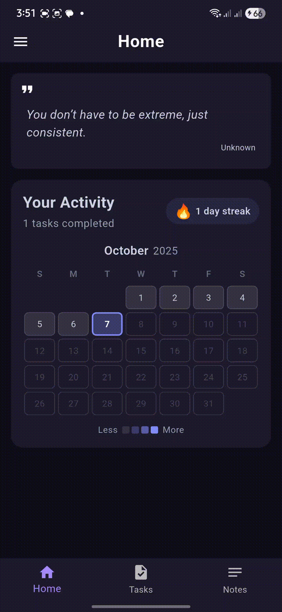

# 📌 My Todo App


A **modern, cross-platform Todo app** built with **Flutter** to manage your tasks, notes, and productivity streaks. Designed with a clean, interactive interface, dark mode, and motivational quotes to keep you inspired.  

---

## 🎬 Demo

  
*Animated GIF showing the Home Page, Tasks, and Notes.*

---

## 🌟 Features

### 🏠 Home Page

- Monthly **activity calendar** with dynamic day colors based on completed tasks
- **Daily streak** tracking
- **Motivational quotes** to boost productivity

### ✅ Tasks Page

- Add, complete, or delete tasks
- Track active vs completed tasks
- Smooth animations for task interactions

### 📝 Notes Page

- Create, update, or delete notes
- Organized view for quick reference

### 🎨 Other Features

- **Dark Mode** toggle
- Modern, interactive UI/UX
- Lightweight and fast
- Emoji animations for fun feedback

---

## 📸 Screenshots

| Home Page | Tasks Page | Notes Page |
|-----------|-----------|------------|
|  |  |  |

| Note View | Note Edit | Drawer |
|-----------|-----------|--------|
|  |  |  |

---

## 🚀 Getting Started

### Prerequisites

- [Flutter SDK](https://flutter.dev/docs/get-started/install)
- Dart

### Installation

```bash
git clone https://github.com/iamammarroshanfekr/todo_app.git
cd todo_app
flutter pub get
flutter run
